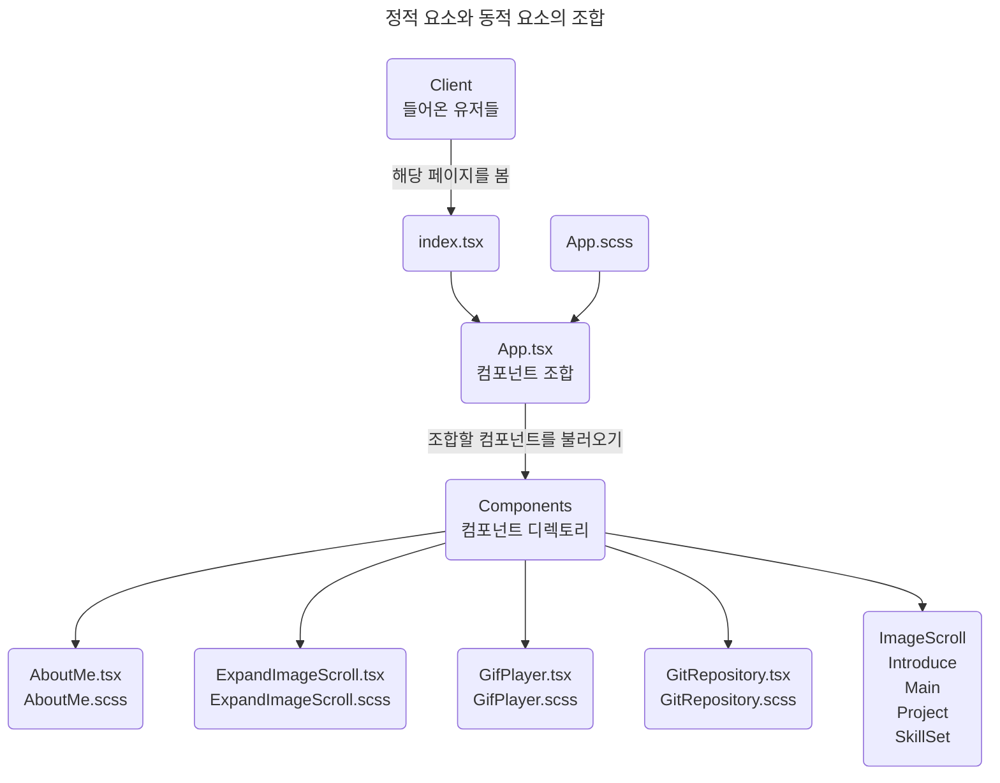

# 공담형의 포트폴리오

---

## 포트폴리오에 사용한 기술

### 1. React

### 2. Typescript

### 3. scss

### 4. 데스크탑과 모바일 두 개 모두 적용한 디자인 - mobile, desktop

### 5. 직접 제작한 Gif 플레이어, 이미지 확대 뷰어 

 

---

## 포트폴리오 요소의 조합 그래프

 

---

## 아직 존재하는 문제 요소

### 1. 페이지 랜딩 시 이미지의 해상도가 너무 높아 로딩이 걸리는 문제가 발생.

### 2. GifPlayer 실행 시 다운로드가 되지 않아 잠깐동안 기다려야 하는 문제 

### 3. 아직 부족한 프로젝트 수, 그리고 명확하지 않은 개발의 방향성 

---

## 이를 해결하기 위해 현재 하는 행동은?

### 1. 현재 Hyperskill 기술 문서를 해독하며 인프라와 기본 기술을 숙달

영어 문서를 번역하면 항상 같은 문장을 두세번 반복해서 읽어야 하기 때문에,

생각보다 숙달이 잘됨

### 2. Programmers 풀스택 부트캠프 진행중

항상 혼자 공부해왔지만, 공부 방식과 더불어 팀 활동,

그리고 수준높은 강의로 인해 현재까지 추상적으로 흩어져 있던 지식들이

구체적으로 결합하는 현상이 정말 빈번하게 발생함 - 좋은 현상

